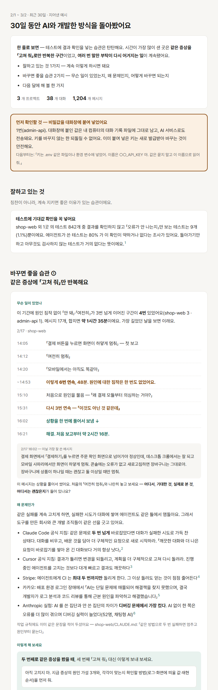

<div align="center">

# ai-dev-feedback

### Feedback you can act on, about how you develop with AI

A monthly look back at your own Claude Code and Codex sessions.<br>
Where time leaked, what to change, why — with sources — and one thing to try next month.

[](LICENSE)
[](https://nodejs.org)
[](#claude-code)
[](#codex)

[](#your-data-stays-yours)

**English** · [한국어](README.ko.md)



<sub>The screenshot uses made-up data (`npm run demo`).</sub>

</div>

---

## Why this exists

AI agents write the code now. What still decides how fast you get somewhere is how you work with them: how you hand work over, how you know it's done, what you do when you get stuck.

Most tools that look at this give you a score or a personality type. Feedback research says that kind of feedback rarely changes anything. What helps is specific behaviour, the reason it matters, and a concrete next step. **ai-dev-feedback** reads the sessions you already had and writes exactly that.

After reading the report you should be able to answer four questions on your own:

1. How am I developing right now?
2. What should I change?
3. Why? (only sources that were checked against the original text)
4. What do I try next? (a sentence you can send as-is, and one if-then plan for next month)

It is not a grade. There are no scores, rankings, streaks or speed numbers, and it never compares you with anyone else.

## What it looks at (v0.1)

| Feedback | Needs |
| --- | --- |
| Asking for "fix it" again and again on the same symptom, with no guess at the cause | AI classification |
| The same instruction repeated across sessions, even after it was written into your rules | AI classification |
| Tests that only run code and never check the result | git |
| Secrets pasted into the chat | — |

Each item only reaches the report once it was right at least 80% of the time against human judgement ([docs/accuracy.md](docs/accuracy.md)). Only advice that holds across tools and models is used — tips that flip between Claude, Codex or model versions are left out ([docs/evidence.md](docs/evidence.md)).

For a long stretch of "fix it", the report shows the timeline, the message where things finally got unstuck, and whether the model changed at that moment — because then the logs alone can't tell which one helped, and it says so.

## Quick start

```bash
npx github:HwangSlater/ai-dev-feedback
```

Answer five short questions (period, projects, read git or not, use AI classification or not, anything you want to focus on) and the report opens in your browser. Next month, `--yes` reuses your answers.

## Use it from your AI tool

### Claude Code

```
/plugin marketplace add HwangSlater/ai-dev-feedback
/plugin install ai-dev-feedback@ai-dev-feedback
```

Then ask: `Look back at how I develop with AI`

### Codex

```
Run `npx -y github:HwangSlater/ai-dev-feedback --yes` and show me the summary.
```

### Plain terminal

```bash
npx github:HwangSlater/ai-dev-feedback              # asks what to look at
npx github:HwangSlater/ai-dev-feedback --yes        # same as last time
npx github:HwangSlater/ai-dev-feedback --no-ai      # nothing leaves your machine
npx github:HwangSlater/ai-dev-feedback scan --json  # what can be analyzed, and the cost
```

AI classification runs on the logged-in `claude` or `codex` CLI, or `ANTHROPIC_API_KEY`. Labels are cached, so after the first run only new messages are classified. If you already use [code-dependent](https://github.com/HwangSlater/code-dependent), its labels are reused.

## Your data stays yours

| Reads | From |
| --- | --- |
| Agent conversations | `~/.claude/projects`, `~/.codex/sessions` |
| git history and test files | the project folders those conversations ran in (only if you say yes) |
| Your rule files | `CLAUDE.md` / `AGENTS.md` in those projects, and memory files under `~/.claude` |

Everything is analyzed on your machine and stored in `~/.ai-dev-feedback/`. With AI classification on, only short snippets of **your own messages** are sent, with keys, tokens, emails and phone numbers masked first. Conversation text, agent replies, tool output and code are never sent. With `--no-ai`, nothing is sent at all.

## Status

Early. The report is in Korean for now. Accuracy so far was measured on the author's own logs and then tuned on the same logs, so treat it as a development figure until it is checked on new data ([docs/accuracy.md](docs/accuracy.md)). Next: feedback that ties conversations to commits (a "done" that wasn't, tests edited to pass) and a look back at a single task.

## License

[MIT](LICENSE) © [HwangSlater](https://github.com/HwangSlater)
